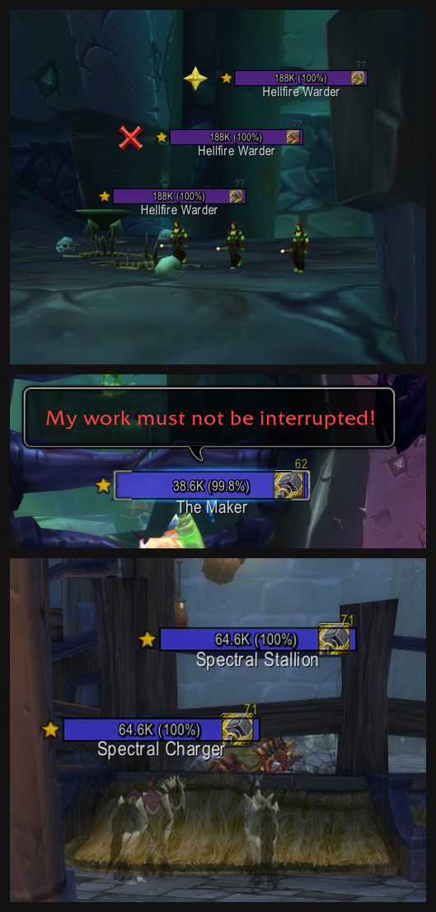

# TotemSense - Tremor Totem Tracker for Plater

Plater Nameplates mod for WoW TBC Classic Shamans. Shows a Tremor Totem icon on nameplates of NPCs that cast Fear, Charm, or Sleep.

Covers Classic and TBC raids and dungeons. Configurable icon size, position, and texture. O(1) NPC lookups, no combat lockout issues, ~9 KB footprint.



## Installation

### Prerequisites
- **Plater Nameplates** addon installed and enabled
- WoW TBC Classic Anniversary (Interface 20505)
- **Python 3** (to generate the import string)

### Steps

1. Run `python3 generate_import_string.py` in the `plater/` directory
2. Copy the output
3. In-game: `/plater` > **Modding** tab > **Import Mod** > paste > **OK**
4. Enable TotemSense in the **Modding** tab, click **Save**, `/reload`

All three hooks are configured on import.

## Customization

Edit the config in the Constructor hook (`plater/constructor.lua`):

```lua
local cfg = {
    iconScale  = 1.0,     -- Icon size as a multiple of the health bar height
    iconTexture = "Interface\\Icons\\Spell_Nature_TremorTotem",
    xOffset    = -2,      -- Horizontal offset (negative = left)
    yOffset    = 0,       -- Vertical offset
}
```

Any WoW interface texture path works for `iconTexture`.

## Database

NPC data lives in `plater/data/`, split by expansion and content type:

```
plater/data/
├── tbc_raids.lua
├── tbc_dungeons.lua
├── classic_raids.lua
└── classic_dungeons.lua
```

Entry format:

```lua
[17521] = {
    spells   = { {id = 30752, name = "Terrifying Howl", type = "fear"} },
    instance = "Karazhan",
    npc      = "The Big Bad Wolf",
}
```

### Coverage

**TBC Raids:** Karazhan, Gruul's Lair, Magtheridon's Lair, SSC, TK: The Eye, Hyjal Summit, Black Temple, Zul'Aman

**TBC Dungeons:** Hellfire Citadel, Coilfang Reservoir, Auchindoun, TK dungeons, Caverns of Time, Magisters' Terrace

**Classic Raids:** MC, Onyxia, BWL, ZG, AQ40, Naxxramas

**Classic Dungeons:** Scholomance, Stratholme, UBRS, LBRS, BRD, and other dungeons with fear effects

## Roadmap

- **Poison Totem tracking** — mark NPCs that apply poisons (Poison Cleansing Totem reminder)
- **Disease Totem tracking** — mark NPCs that apply diseases (Disease Cleansing Totem reminder)
- **Grounding Totem tracking** — mark NPCs that cast harmful single-target spells (Grounding Totem reminder)
- **Standalone addon** — work with stock Blizzard nameplates without requiring Plater

## Troubleshooting

- Ensure Plater is enabled and enemy nameplates are visible (`V` key)
- Verify TotemSense is enabled in Plater's Modding tab
- `/reload` to reset

## Contributing

See [CONTRIBUTING.md](CONTRIBUTING.md) for details on adding NPCs.

## Credits

NPC database from Wowhead, Icy Veins, and community raid guides.
